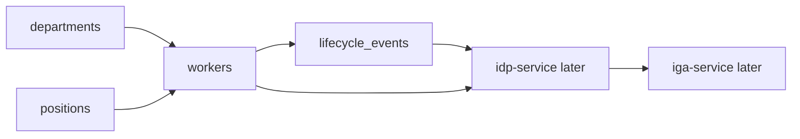

# HRMS Service

## Start here

`hrms-service` simulates a Human Resource Management System such as Workday, SAP SuccessFactors, Oracle HCM, or PeopleSoft.

It is the authoritative source for worker lifecycle data.

Simple mapping:

```text
workers          -> people/employees
departments      -> organization structure
positions        -> job/role context
lifecycle_events -> joiner/mover/leaver changes
```

Simple flow:



More details:

- [Overview](docs/overview.md)
- [Full diagrams](docs/diagrams.md)
- [Data model](docs/data-model.md)
- [Security controls](docs/security-controls.md)

## Purpose

`hrms-service` drives identity lifecycle for the lab.

It answers:

```text
Who joined?
Who moved departments?
Who changed manager?
Who changed worker type?
Who left the organization?
```

## Integration pattern

```text
Integration type: HRMS source
Primary data style: JSON first, REST + database later
Downstream systems: idp-service and iga-service
UI in milestone 1: No full UI; minimal admin UI later
Primary implementation language: Python
```

## Why HRMS matters

IGA is weak without a reliable authoritative source.

HRMS gives the identity lifecycle foundation for:

```text
joiner provisioning
mover review
leaver deprovisioning
manager-based approval routing
department-based birthright access
worker-type based restrictions
```

## Folder structure

```text
apps/hrms-service/
├── README.md
├── data/
│   ├── workers.json
│   ├── departments.json
│   ├── positions.json
│   └── lifecycle-events.json
├── docs/
│   ├── overview.md
│   ├── objectives.md
│   ├── hld.md
│   ├── dld.md
│   ├── data-model.md
│   ├── diagrams.md
│   ├── security-controls.md
│   ├── audit-events.md
│   └── ui-decision.md
├── scripts/
└── tests/
```

## Milestone 1 scope

Milestone 1 focuses on design and sample data.

No real HR data, no real employee data, and no production integration.
