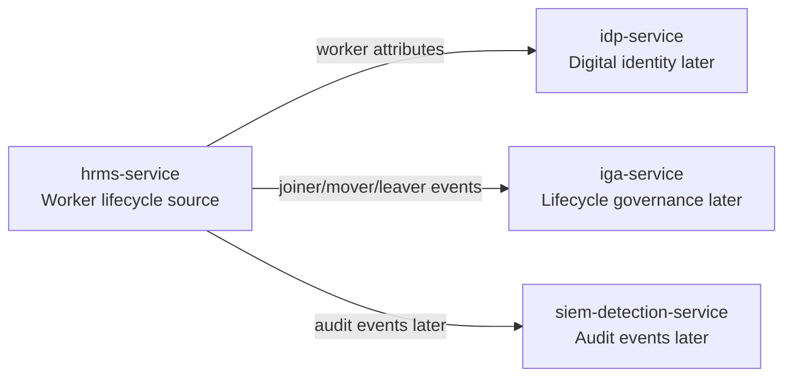
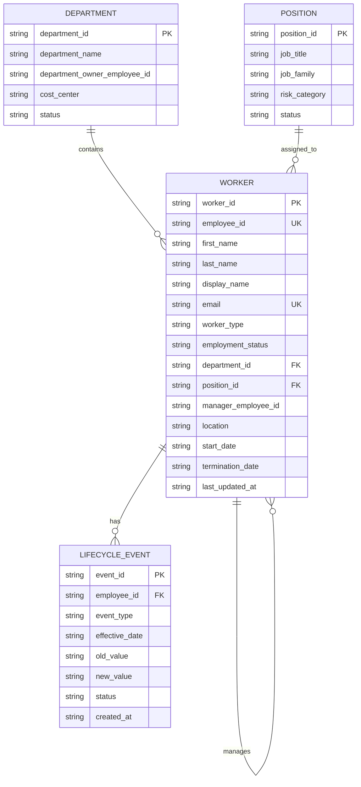
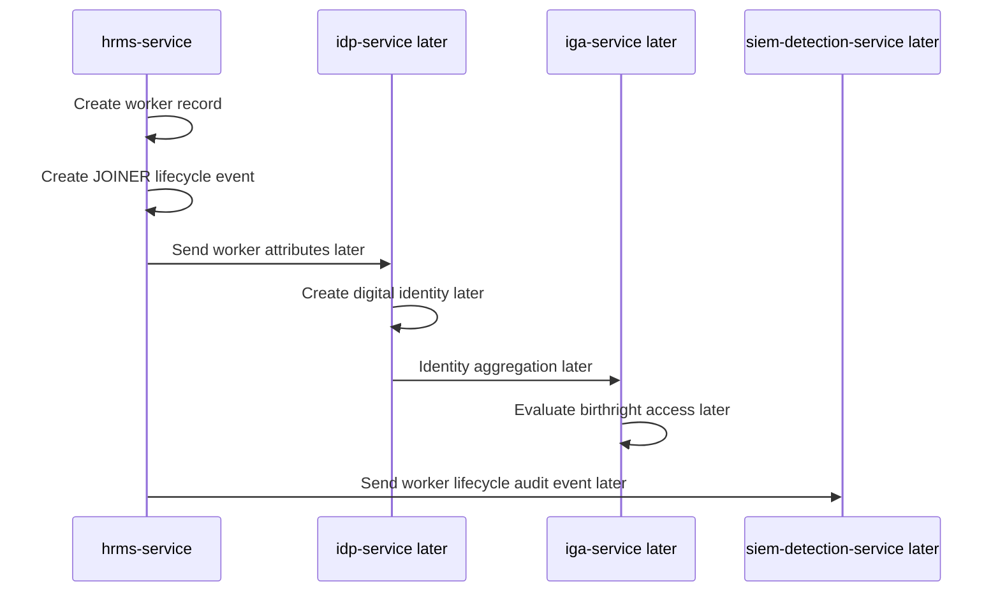
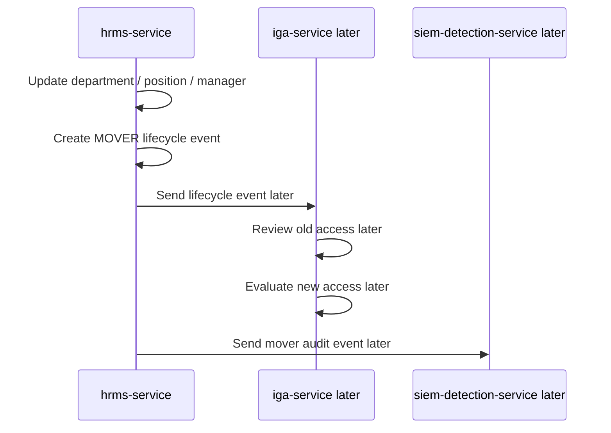
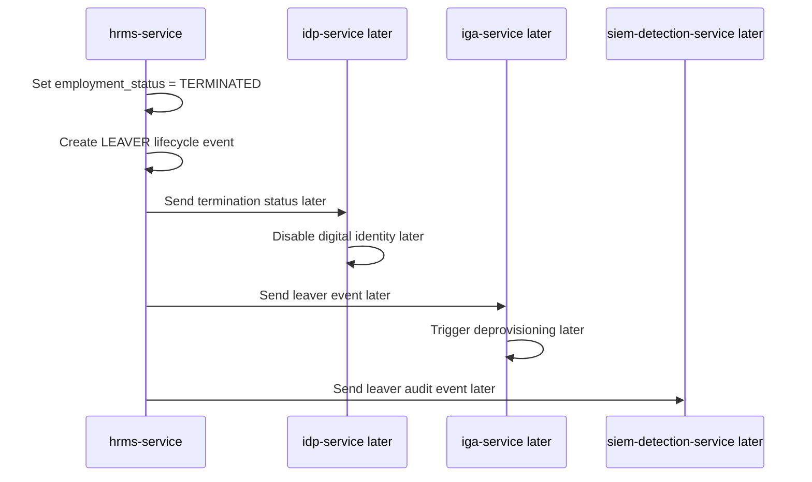
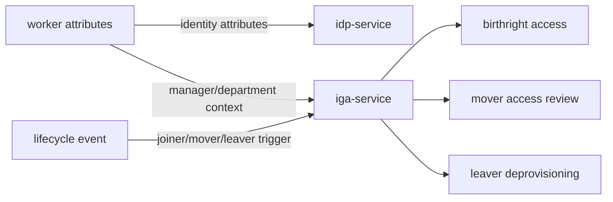

# HRMS Service Diagrams

This document contains Mermaid diagrams specific to `hrms-service`.

## 1. HRMS Context Diagram

## 2. HRMS Entity Relationship Diagram

## 3. Joiner Flow

## 4. Mover Flow

## 5. Leaver Flow

## 6. Downstream Governance Mapping

