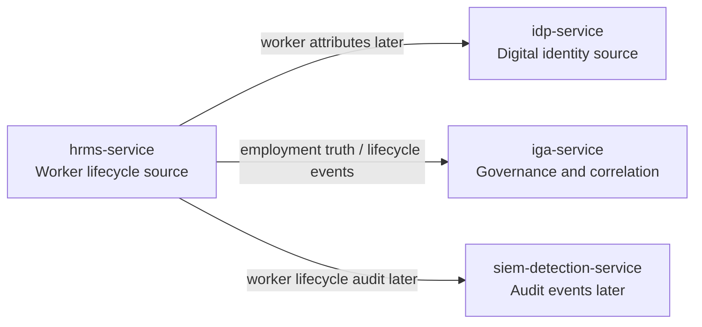
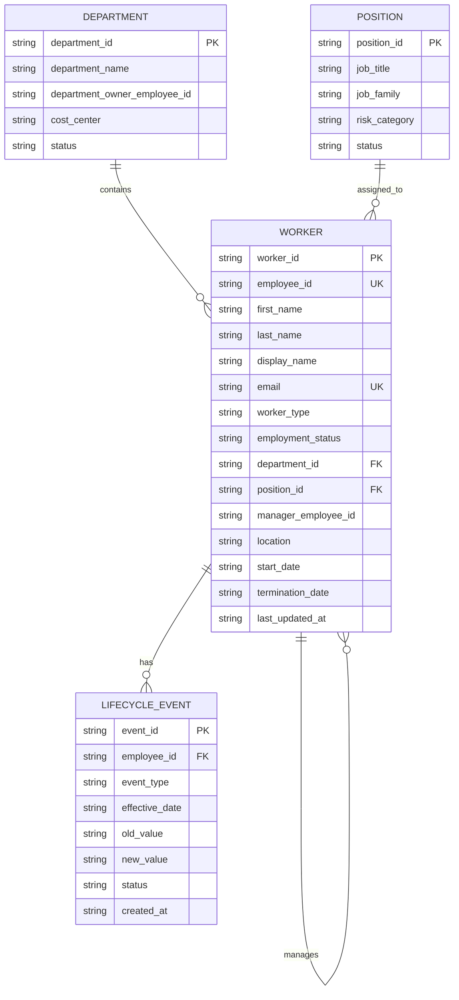
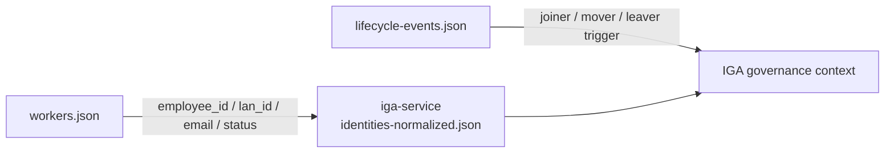
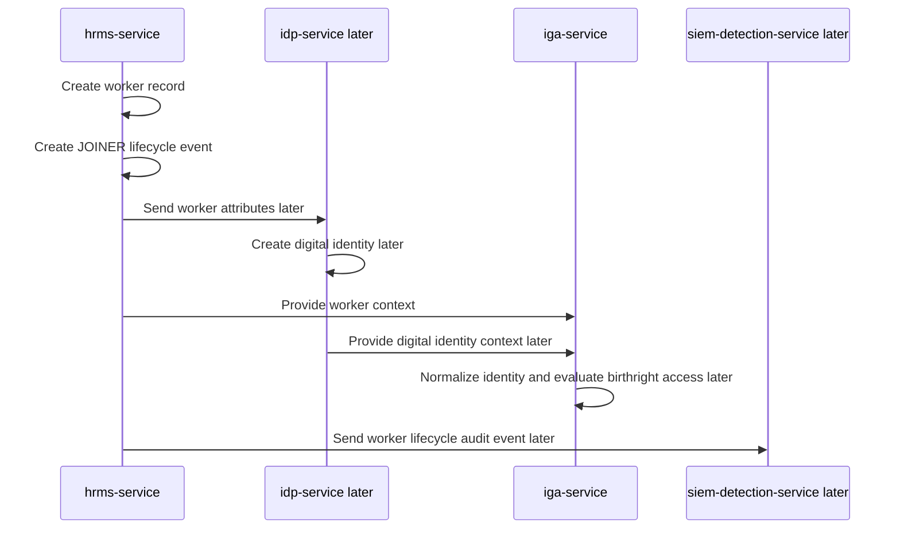
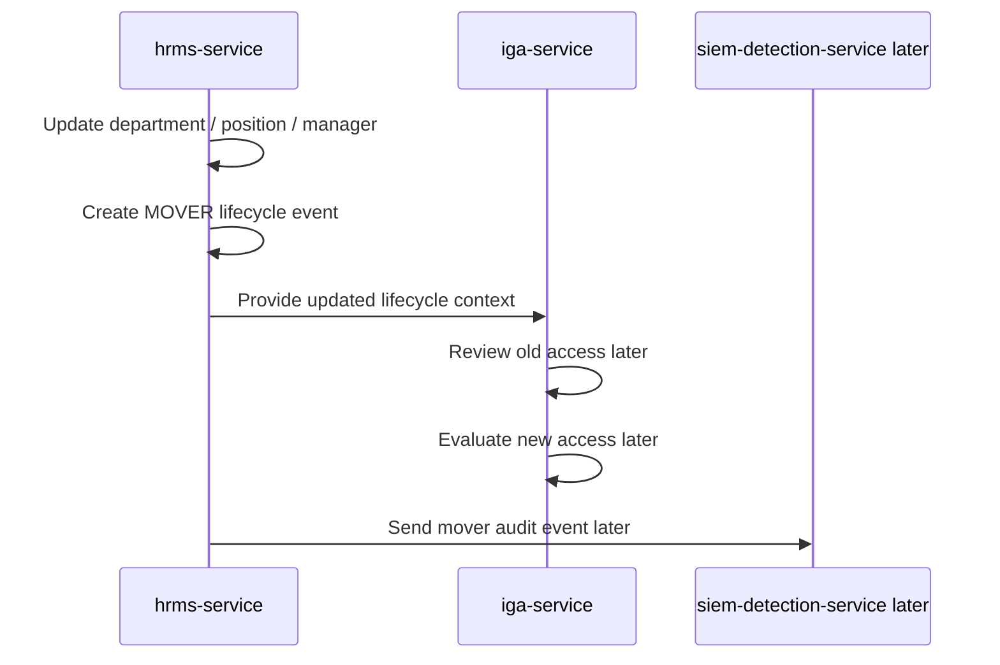
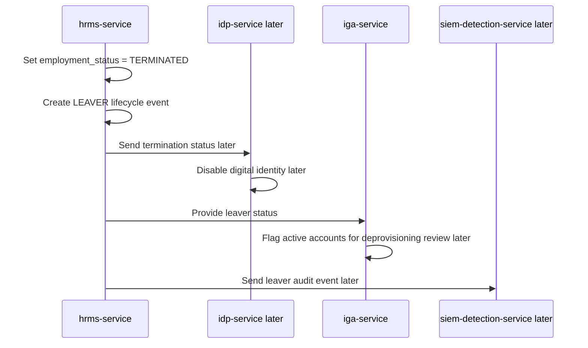
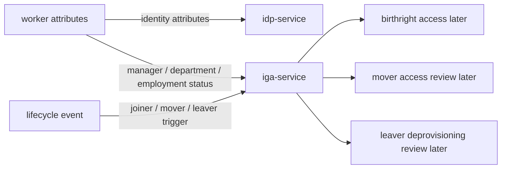

# HRMS Service Diagrams

This document contains Mermaid diagrams specific to `hrms-service`.

## 1. HRMS Context Diagram

## 2. HRMS Entity Relationship Diagram

## 3. HRMS to IGA Normalization Flow

## 4. Joiner Flow

## 5. Mover Flow

## 6. Leaver Flow

## 7. Downstream Governance Mapping

