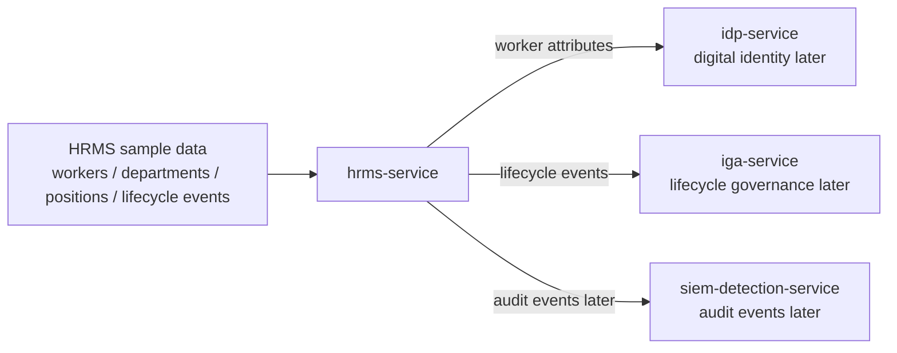

# HRMS Service HLD

## High-level responsibility

`hrms-service` is the authoritative source for worker lifecycle data.

It provides worker, department, position, and lifecycle event data to downstream identity systems.

## High-level architecture



## Trust boundary

```text
HRMS is the source of employment truth.
IdP should not invent worker lifecycle status.
IGA should use HRMS status to trigger access decisions.
```

## Inbound flow

Milestone 1 uses static fake JSON data.

Later inbound flows may include:

```text
create worker
update worker
create lifecycle event
update department
update position
```

## Outbound flow

Later outbound flows:

```text
worker data -> idp-service
lifecycle events -> iga-service
audit events -> siem-detection-service
```

## Authentication and authorization assumption

Milestone 1 has no runtime API.

Future API should require:

```text
service-to-service authentication
admin authorization for HR updates
read-only access for downstream aggregation
object-level authorization if UI is added
```

## Deployment assumption

Milestone 1:

```text
fake JSON data
local files
no network exposure
```

Later:

```text
REST API
SQLite/PostgreSQL storage
minimal HR admin UI
```
