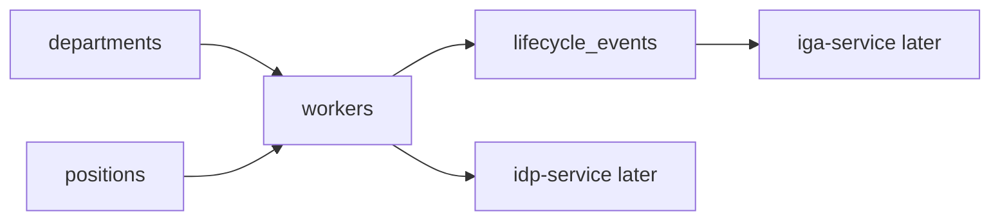

# HRMS Service Overview

## One-line purpose

`hrms-service` is the authoritative worker lifecycle source for Luffy.

It provides fake/sample employee data that later drives IdP identity creation and IGA lifecycle governance.

## Simplest mental model

```text
workers          -> employees / contractors
departments      -> organization structure
positions        -> job context
lifecycle_events -> joiner / mover / leaver changes
```

## Simple diagram



## What to understand first

1. HRMS owns worker lifecycle truth.
2. IdP owns digital identity and login.
3. IGA owns access governance.
4. HRMS changes should trigger downstream identity/access actions.
5. HRMS must not store unnecessary sensitive data in this lab.

## First lifecycle events

```text
JOINER
MOVER
LEAVER
MANAGER_CHANGE
DEPARTMENT_CHANGE
WORKER_TYPE_CHANGE
```

## Files that matter first

```text
data/workers.json
data/departments.json
data/positions.json
data/lifecycle-events.json
docs/data-model.md
docs/diagrams.md
```
