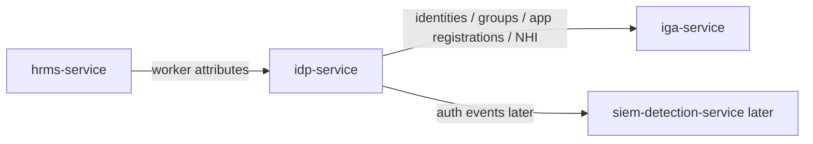

# IdP Service

## Start here

`idp-service` simulates an Identity Provider such as Entra ID, Okta, Ping, or Keycloak.

It owns digital identity, groups, app registrations, authentication metadata, and machine identity records.

Simple mapping:

```text
identities          -> digital users
groups              -> login/access groups
group_memberships   -> who is in which group
app_registrations   -> SSO/OIDC/SAML/API clients
app_assignments     -> which group grants login to which app
machine_identities  -> service accounts, OAuth clients, service principals
```

Simple flow:



More details:

- [Overview](docs/overview.md)
- [Full diagrams](docs/diagrams.md)
- [Data model](docs/data-model.md)
- [GraphQL contract](docs/graphql-contract.md)
- [Security controls](docs/security-controls.md)

## Purpose

`idp-service` answers:

```text
Who is the digital identity?
Which groups is the identity in?
Which applications are registered for login?
Which groups grant app login?
Which machine identities exist?
Which OAuth clients/service principals are in use?
```

## Integration pattern

```text
Integration type: IdP source
Primary API style now: FastAPI read-only REST API
UI style now: simple browser UI rendered by FastAPI
Future API style: GraphQL for identity relationship queries
Downstream system: iga-service
Primary implementation language: Python
```

## Why GraphQL later

IdP data is relationship-heavy:

```text
identity -> groups -> app assignments -> app registrations
machine identity -> OAuth client -> app registration -> owner
```

GraphQL is useful for asking flexible questions about these relationships.

## Folder structure

```text
apps/idp-service/
├── README.md
├── data/
│   ├── identities.json
│   ├── groups.json
│   ├── group-memberships.json
│   ├── app-registrations.json
│   ├── app-assignments.json
│   └── machine-identities.json
├── docs/
│   ├── overview.md
│   ├── objectives.md
│   ├── hld.md
│   ├── dld.md
│   ├── data-model.md
│   ├── diagrams.md
│   ├── graphql-contract.md
│   ├── security-controls.md
│   ├── audit-events.md
│   └── ui-decision.md
├── graphql/
│   ├── schema.graphql
│   └── example-queries.graphql
├── scripts/
│   └── validate_idp_data.py
├── src/
│   ├── repository.py
│   └── fastapi_app.py
└── tests/
    ├── test_idp_data.py
    └── test_idp_fastapi.py
```

## Validate sample data

From the repository root:

```bash
python apps/idp-service/scripts/validate_idp_data.py
```

## Run tests

From the repository root:

```bash
python -m pytest apps/idp-service/tests -q
```

## Install FastAPI runtime locally

```bash
python -m pip install fastapi uvicorn httpx
```

## Run FastAPI app

From the repository root:

```bash
cd apps/idp-service/src
uvicorn fastapi_app:app --reload --port 8002
```

The app runs at:

```text
http://127.0.0.1:8002
```

Browser UI:

```text
http://127.0.0.1:8002/ui
```

Interactive API docs:

```text
http://127.0.0.1:8002/docs
```

## Browser UI pages

```text
/ui
/ui/identities
/ui/groups
/ui/app-registrations
/ui/machine-identities
```

## Read-only API endpoints

```text
GET /health
GET /dashboard
GET /identities
GET /groups
GET /group-memberships
GET /app-registrations
GET /app-assignments
GET /machine-identities
GET /identity/{identity_id}/profile
```

Example:

```text
GET /identity/IDP-1004/profile
```

## Milestone 1 scope

Milestone 1 now includes design, sample data, validation, FastAPI read-only API, and a simple browser UI.

No real identities, no real tokens, no real secrets, and no production SSO integration.
