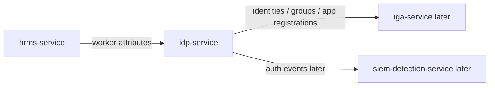

# IdP Service

## Start here

`idp-service` simulates an Identity Provider such as Entra ID, Okta, Ping, or Keycloak.

It owns digital identity, groups, app registrations, authentication metadata, and machine identity records.

Simple mapping:

```text
identities        -> digital users
groups            -> login/access groups
app_registrations -> SSO/OIDC/SAML/API clients
machine_identities -> service accounts, OAuth clients, service principals
```

Simple flow:



More details:

- [Overview](docs/overview.md)
- [Full diagrams](docs/diagrams.md)
- [Data model](docs/data-model.md)
- [GraphQL contract](docs/graphql-contract.md)
- [Security controls](docs/security-controls.md)

## Purpose

`idp-service` answers:

```text
Who is the digital identity?
Which groups is the identity in?
Which applications are registered for login?
Which groups grant app login?
Which machine identities exist?
Which OAuth clients/service principals are in use?
```

## Integration pattern

```text
Integration type: IdP source
Primary API style: GraphQL for identity relationship queries
Secondary API style: REST login/token simulation later
Downstream system: iga-service
UI in milestone 1: No full UI; minimal admin UI later
Primary implementation language: Python
```

## Why GraphQL here

IdP data is relationship-heavy:

```text
identity -> groups -> app assignments -> app registrations
machine identity -> OAuth client -> app registration -> owner
```

GraphQL is useful for asking flexible questions about these relationships.

## Folder structure

```text
apps/idp-service/
├── README.md
├── data/
│   ├── identities.json
│   ├── groups.json
│   ├── group-memberships.json
│   ├── app-registrations.json
│   ├── app-assignments.json
│   └── machine-identities.json
├── docs/
│   ├── overview.md
│   ├── objectives.md
│   ├── hld.md
│   ├── dld.md
│   ├── data-model.md
│   ├── diagrams.md
│   ├── graphql-contract.md
│   ├── security-controls.md
│   ├── audit-events.md
│   └── ui-decision.md
├── graphql/
│   ├── schema.graphql
│   └── example-queries.graphql
├── scripts/
└── tests/
```

## Milestone 1 scope

Milestone 1 focuses on design, sample data, GraphQL schema, and validation.

No real identities, no real tokens, no real secrets, and no production SSO integration.
