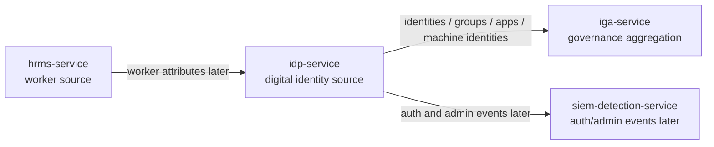
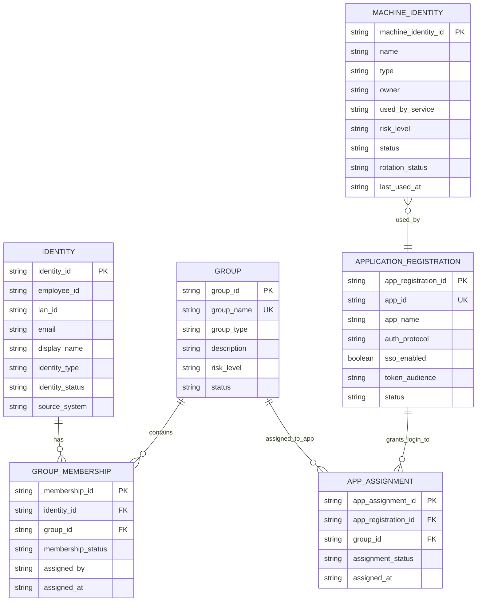
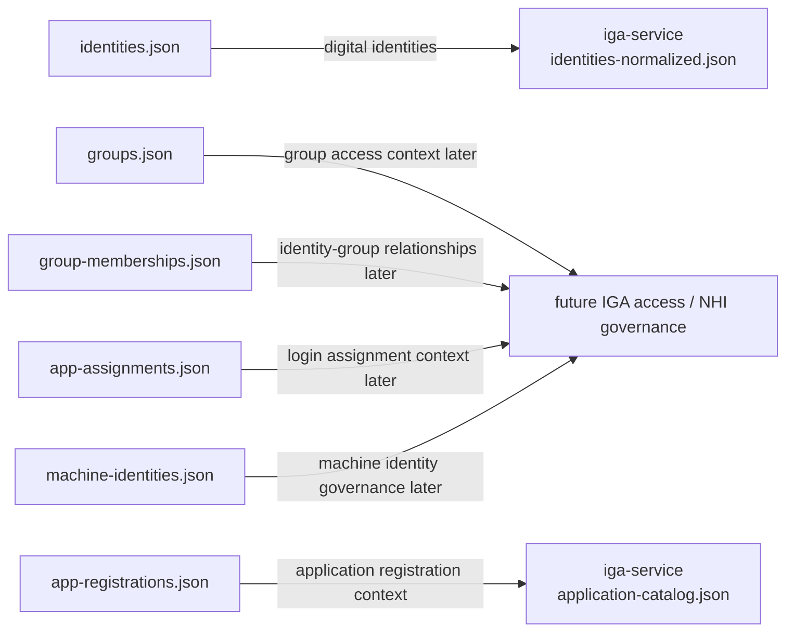
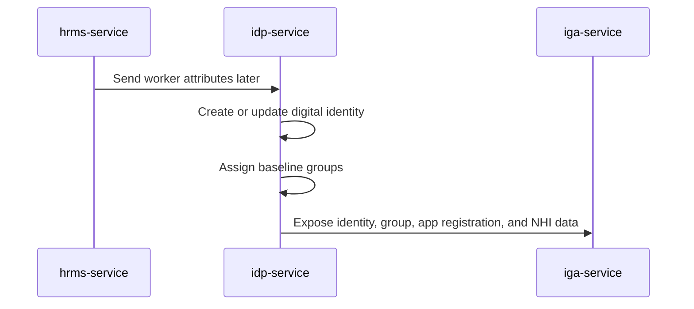
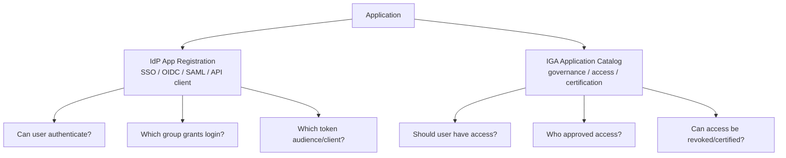
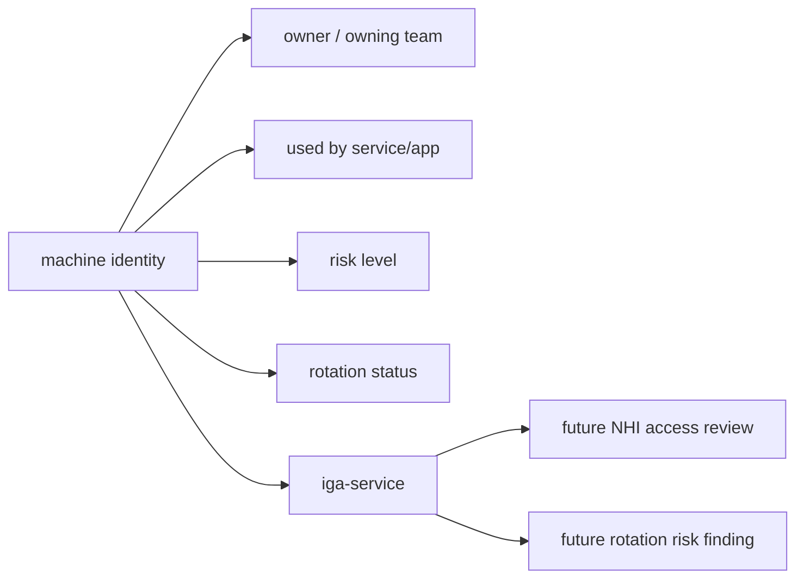
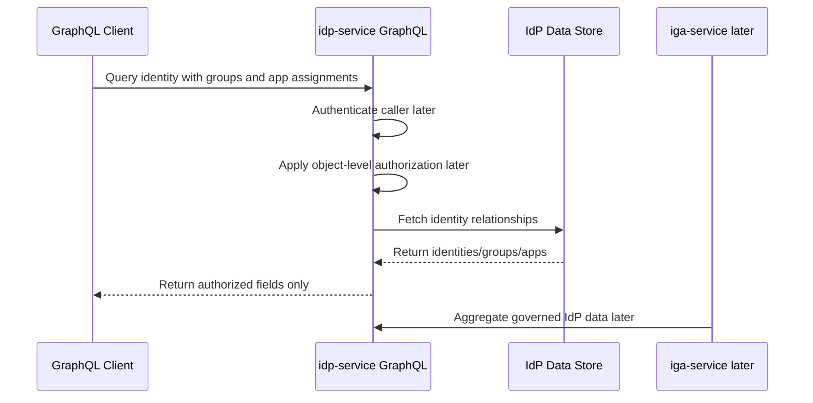

# IdP Service Diagrams

This document contains Mermaid diagrams specific to `idp-service`.

## 1. IdP Context Diagram

## 2. IdP Entity Relationship Diagram

## 3. IdP to IGA Normalization Flow

## 4. HRMS to IdP Identity Flow

## 5. App Registration vs IGA Onboarding

## 6. Machine Identity Governance Flow

## 7. Future GraphQL Query Flow

