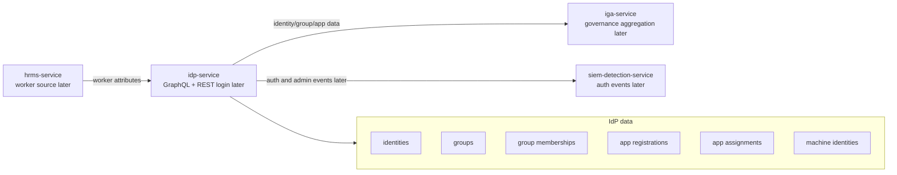

# IdP Service HLD

## High-level responsibility

`idp-service` represents the digital identity provider layer for Luffy.

It stores identities, groups, app registrations, app assignments, and machine identities.

## High-level architecture



## Trust boundary

```text
HRMS is the authoritative employment source.
IdP is the authoritative digital identity/authentication source.
IGA is the governance source.
```

## Inbound flow

Milestone 1 uses static fake JSON data.

Future inbound flows may include:

```text
worker sync from hrms-service
admin creates group
admin registers application
admin assigns group to application
admin registers machine identity
```

## Outbound flow

Later outbound flows:

```text
identity aggregation -> iga-service
group aggregation -> iga-service
app registration data -> iga-service
machine identity data -> iga-service
auth/admin events -> siem-detection-service
```

## Authentication and authorization assumption

Milestone 1 has no runtime authentication.

Future API should include:

```text
GraphQL authentication
object-level authorization
admin-only mutations
read-only aggregation access for iga-service
no token/secret exposure
```

## Deployment assumption

Milestone 1:

```text
fake JSON data
GraphQL schema design
no real auth
no network exposure
```

Later:

```text
Python GraphQL API
mock REST login/token endpoint
SQLite/PostgreSQL storage
minimal IdP admin UI
```
