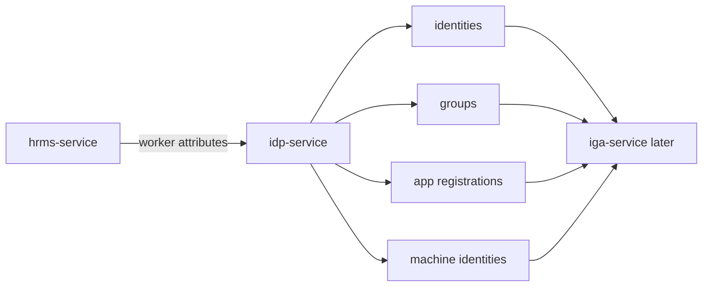

# IdP Service Overview

## One-line purpose

`idp-service` is the digital identity and authentication source for Luffy.

It receives worker context from `hrms-service` later and exposes digital identity, group, app registration, and machine identity data to `iga-service`.

## Simplest mental model

```text
identity           -> digital user
group              -> collection of identities
app_registration   -> app configured for login/authentication
app_assignment     -> group-to-app login assignment
machine_identity   -> non-human identity such as OAuth client or service principal
```

## Simple diagram



## What to understand first

1. HRMS tells who the person is from an employment perspective.
2. IdP represents that person as a digital identity.
3. Groups and app assignments determine login eligibility.
4. IdP app registration is not the same as IGA onboarding.
5. Machine identities should be treated as first-class identities later.

## First IdP objects

```text
Identity
Group
GroupMembership
ApplicationRegistration
AppAssignment
MachineIdentity
```

## GraphQL role

GraphQL is used because IdP questions are relationship-heavy:

```text
Show this identity, its groups, and app assignments.
Show this app and which groups grant login.
Show this machine identity and its owner/risk.
```
