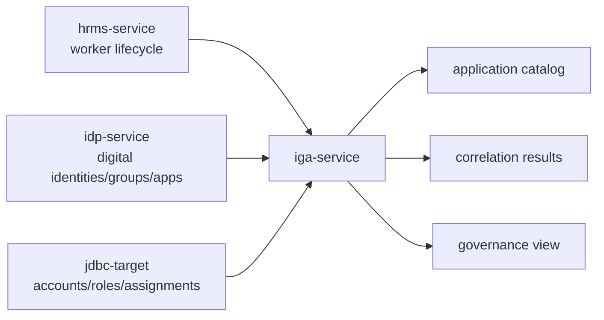

# IGA Service

## Start here

`iga-service` simulates a SailPoint-like Identity Governance and Administration platform.

It is not an IdP and it is not an HRMS.

It governs access by connecting identities, accounts, entitlements, applications, assignments, approvals, and certification data.

Simple mapping:

```text
identity      -> governed person or non-human identity
application   -> onboarded app/source in IGA
account       -> user's account inside an application
entitlement   -> role/group/permission inside an application
assignment    -> account has entitlement
correlation   -> account matched to identity
```

Simple flow:



## Purpose

`iga-service` answers:

```text
Which applications are onboarded?
Which identities exist?
Which application accounts exist?
Which entitlements exist?
Who has what access?
Can an account be correlated to an identity?
Is access high-risk?
Can access be reviewed/certified later?
```

## Integration pattern

```text
Integration type: IGA/governance platform
Primary API style now: standard-library read-only HTTP API
Primary API style later: GraphQL for governance relationship queries
Data style in milestone 1: normalized JSON
UI in milestone 1: design only; governance UI later
Primary implementation language: Python
```

## Why GraphQL later

IGA data is highly connected:

```text
identity -> accounts -> assignments -> entitlements -> applications -> risk -> certification
```

GraphQL is useful for querying these relationships without creating many fixed REST endpoints.

## Folder structure

```text
apps/iga-service/
├── README.md
├── data/
│   ├── application-catalog.json
│   ├── identities-normalized.json
│   ├── accounts-normalized.json
│   ├── entitlements-normalized.json
│   ├── assignments-normalized.json
│   └── correlation-results.json
├── docs/
│   ├── overview.md
│   ├── objectives.md
│   ├── hld.md
│   ├── dld.md
│   ├── data-model.md
│   ├── diagrams.md
│   ├── graphql-contract.md
│   ├── security-controls.md
│   ├── audit-events.md
│   └── ui-decision.md
├── graphql/
│   ├── schema.graphql
│   └── example-queries.graphql
├── scripts/
│   └── validate_iga_data.py
├── src/
│   ├── repository.py
│   └── server.py
└── tests/
    ├── test_iga_data.py
    └── test_iga_api.py
```

## Validate data

From the repository root:

```bash
python apps/iga-service/scripts/validate_iga_data.py
```

## Run tests

From the repository root:

```bash
python -m pytest apps/iga-service/tests -q
```

## Run local read-only API

From the repository root:

```bash
cd apps/iga-service/src
python server.py
```

The API runs at:

```text
http://127.0.0.1:8001
```

## Read-only API endpoints

```text
GET /health
GET /applications
GET /identities
GET /accounts
GET /entitlements
GET /assignments
GET /correlation-results
GET /governance/orphan-accounts
GET /governance/high-risk-access
GET /governance/identity/{identity_id}/access
```

Example:

```text
GET /governance/identity/IGA-IDENTITY-1001/access
```

## Milestone 1 scope

Milestone 1 creates the IGA normalized model and a local read-only API over the normalized JSON data.

No real provisioning, no real approvals, no real access changes, and no production integration.
