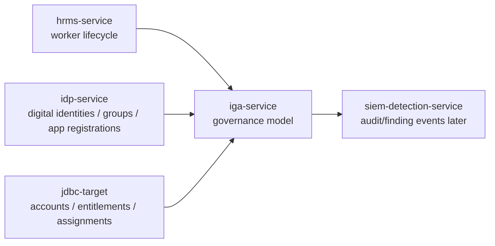
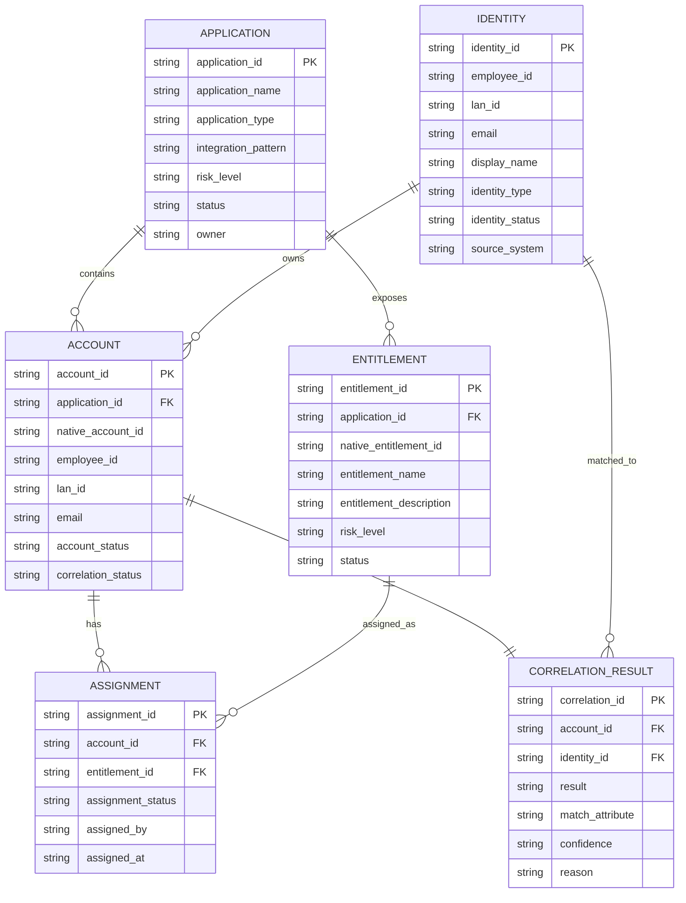
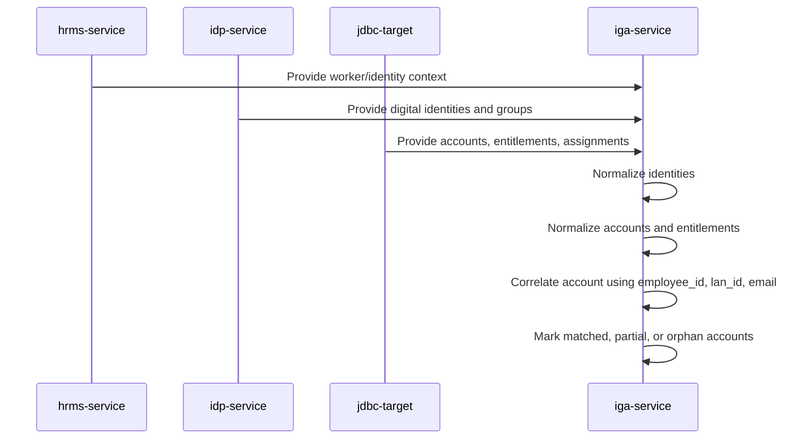
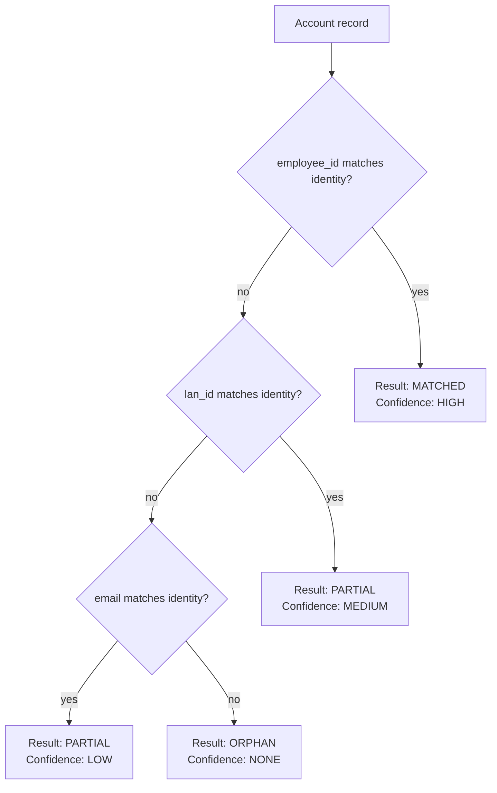
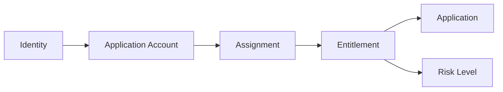
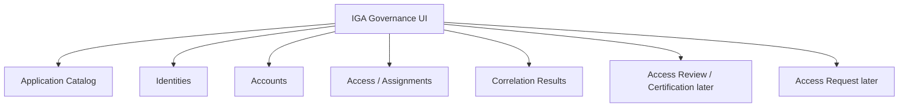

# IGA Service Diagrams

This document contains Mermaid diagrams specific to `iga-service`.

## 1. IGA Context Diagram

## 2. IGA Normalized Entity Relationship Diagram

## 3. Aggregation and Correlation Flow

## 4. Correlation Decision Logic

## 5. Governance Relationship View

## 6. Future IGA UI Flow

