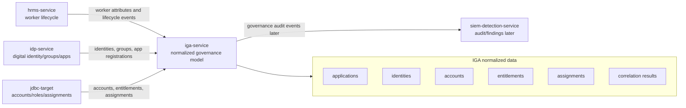

# IGA Service HLD

## High-level responsibility

`iga-service` provides the normalized governance layer for Luffy.

It consumes identity lifecycle data, digital identity data, and target application access data, then represents them as governed IGA objects.

## High-level architecture



## Trust boundary

```text
HRMS is the employment lifecycle source.
IdP is the digital identity/authentication source.
Target apps are the access/account sources.
IGA is the governance and decision source.
```

## Inbound flow

Milestone 1 uses normalized JSON.

Future inbound flows may include:

```text
HRMS lifecycle aggregation
IdP identity/group/app aggregation
JDBC account/entitlement aggregation
SCIM target aggregation
PAM target aggregation
```

## Outbound flow

Later outbound flows:

```text
access request decisions
provisioning commands
certification decisions
audit events
risk findings
```

## Authentication and authorization assumption

Milestone 1 has no runtime API.

Future API should include:

```text
GraphQL authentication
role-based authorization
object-level authorization
separation between requester, approver, reviewer, and admin actions
```

## Deployment assumption

Milestone 1:

```text
normalized JSON data
GraphQL schema design
validation tests
no real provisioning
```

Later:

```text
Python GraphQL API
SQLite/PostgreSQL storage
IGA governance UI
API integrations with other Luffy services
```
