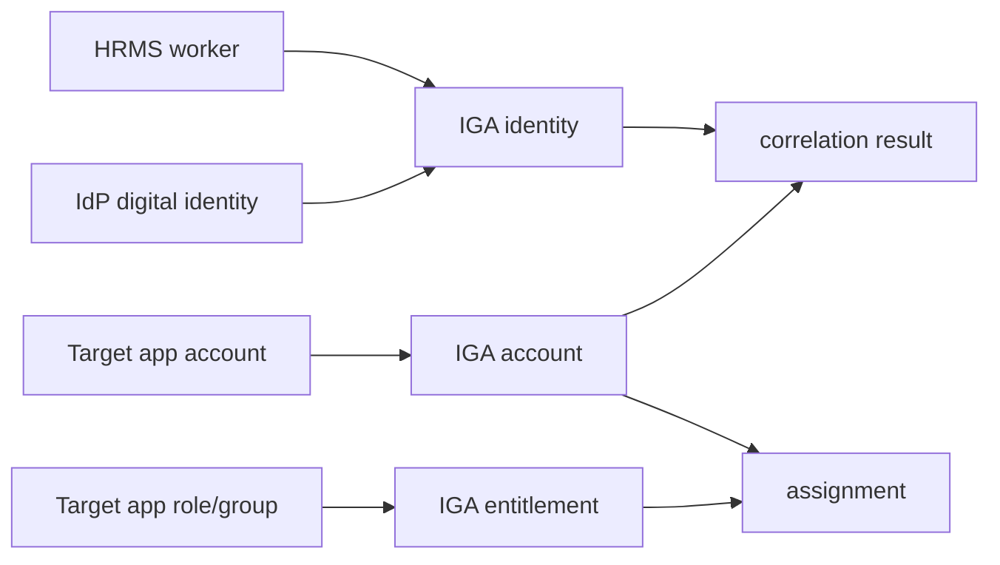

# IGA Service Overview

## One-line purpose

`iga-service` is the governance brain of Luffy.

It connects HRMS workers, IdP identities, and target application accounts/entitlements into one normalized governance model.

## Simplest mental model

```text
HRMS tells who the worker is.
IdP tells who the digital identity is.
Target apps tell what accounts and access exist.
IGA connects everything and governs access.
```

## Simple diagram



## What to understand first

1. A person is not the same as an account.
2. An IdP app registration is not the same as IGA onboarding.
3. Target applications expose accounts and entitlements.
4. IGA normalizes all data into a governance model.
5. Correlation links app accounts back to identities.

## First IGA objects

```text
Application
Identity
Account
Entitlement
Assignment
CorrelationResult
```

## Milestone 1 output

Milestone 1 proves that we can model:

```text
application catalog
normalized identities
normalized accounts
normalized entitlements
normalized assignments
correlation results
```
