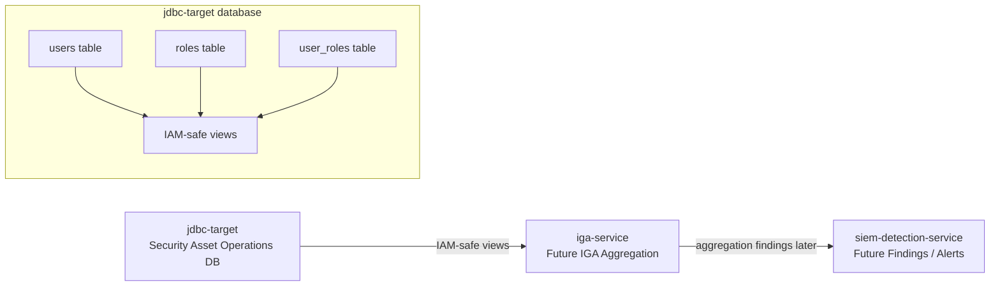
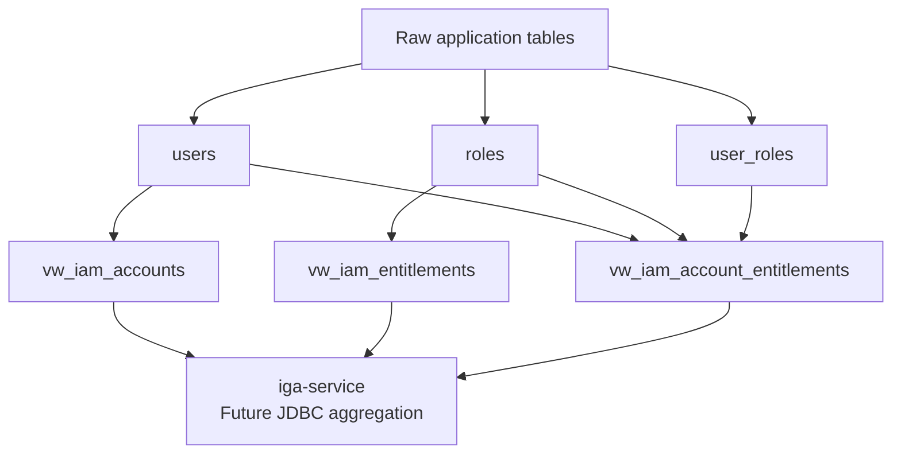
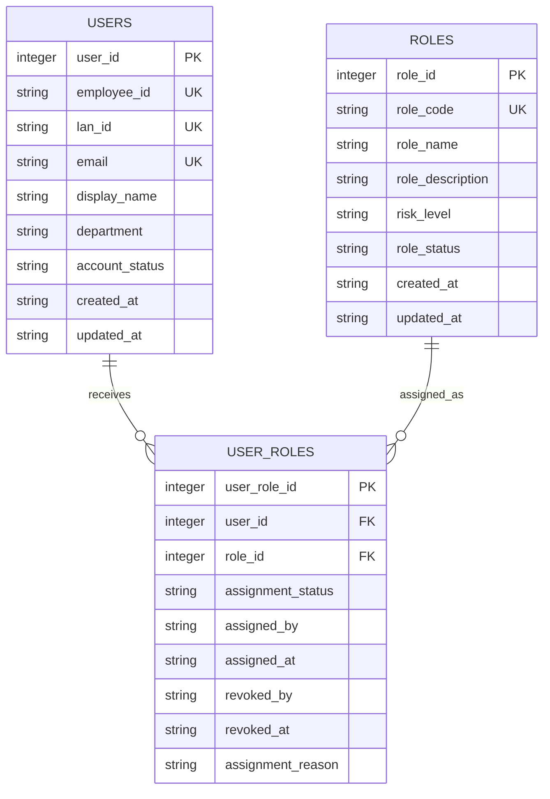
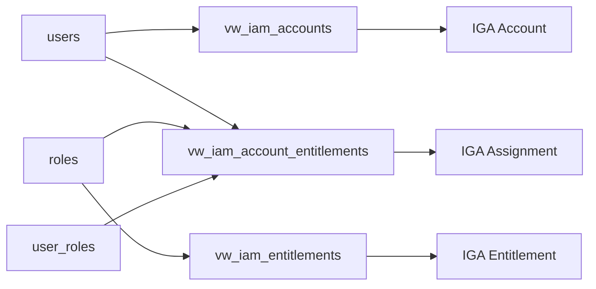
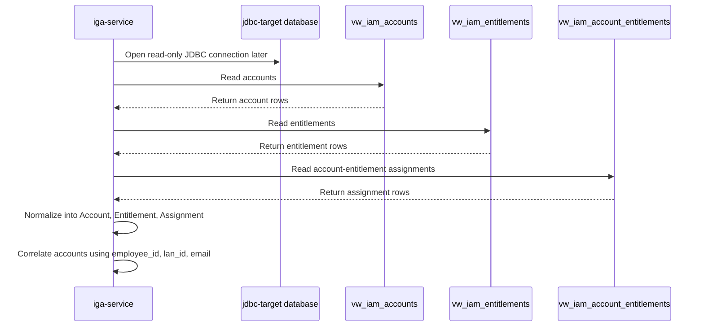
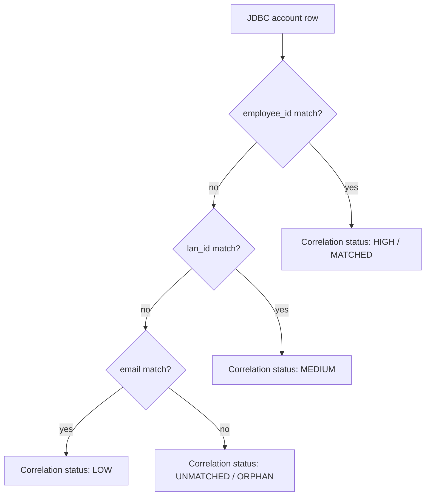
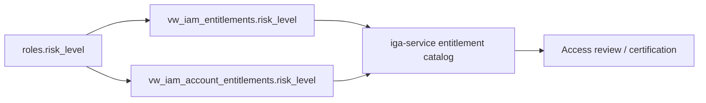
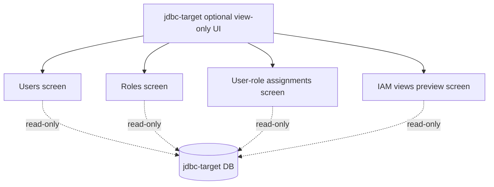

# JDBC Target Diagrams

This document contains Mermaid diagrams specific to `jdbc-target`.

`jdbc-target` simulates a database-backed security asset operations application that exposes IAM-safe views for SailPoint/IGA-style JDBC aggregation.

## 1. JDBC Target Context Diagram

## 2. JDBC Target HLD Diagram

## 3. JDBC Target Entity Relationship Diagram

## 4. IAM View Mapping Diagram

## 5. Future JDBC Aggregation Sequence

## 6. Correlation Logic Diagram

## 7. Risk Visibility Diagram

## 8. Optional Future UI Diagram

