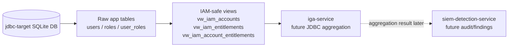

# JDBC Target HLD

## High-level responsibility

`jdbc-target` provides a database-backed target application access model for IGA aggregation.

It exposes clean IAM-safe views that `iga-service` can read later.

## High-level architecture



## Trust boundary

```text
Raw application tables are inside jdbc-target.
IGA should not directly read raw tables.
IGA should read only IAM-safe views.
```

## Inbound flow

Milestone 1 has no runtime API.

Data is loaded by SQL scripts:

```text
schema.sql
seed.sql
views.sql
```

## Outbound flow

Future `iga-service` will read:

```text
vw_iam_accounts
vw_iam_entitlements
vw_iam_account_entitlements
```

## Authentication and authorization assumption

Milestone 1 uses local SQLite only.

Future database access should use:

```text
Least-privilege read-only DB user for IGA aggregation
No raw table access for IGA
No write privileges unless explicitly required later
```

## Deployment assumption

Milestone 1:

```text
Local SQLite database
Fake sample data
No network exposure
```

Later:

```text
PostgreSQL or managed cloud database simulation
Read-only user and controlled IAM views
```
