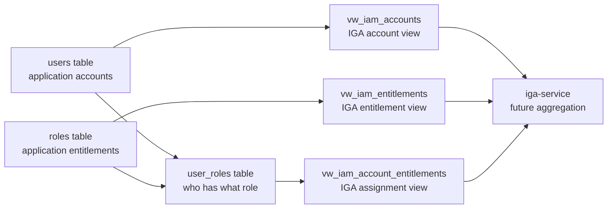

# JDBC Target Overview

## One-line purpose

`jdbc-target` is a database-backed application that exposes clean IAM views so `iga-service` can aggregate accounts, entitlements, and assignments like a SailPoint JDBC integration.

## Simplest mental model

```text
users       -> accounts
roles       -> entitlements
user_roles  -> account-entitlement assignments
```

## Simple diagram



## What to understand first

1. The app stores users and roles in database tables.
2. The app maps users to roles using `user_roles`.
3. IGA should not read raw tables directly.
4. IGA should read only controlled views.
5. Later, IGA will correlate these accounts to HRMS/IdP identities.

## Files that matter first

```text
db/schema.sql   -> creates users, roles, user_roles
db/seed.sql     -> adds sample users, roles, assignments
db/views.sql    -> creates IAM-safe views
scripts/run_sqlite.py -> builds and previews the local database
tests/test_jdbc_target.py -> validates the database and views
```

## Full diagrams

See:

```text
apps/jdbc-target/docs/diagrams.md
```

That file has the detailed diagrams. Start with this overview first.
