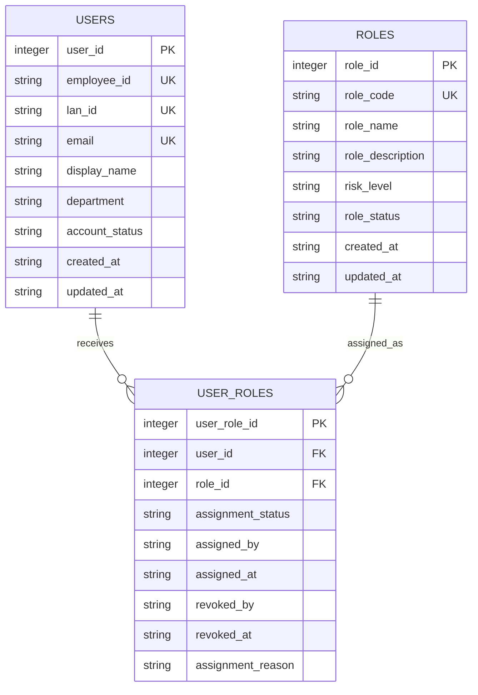

# JDBC Target Relationship Diagram

## Entity relationship diagram



## Relationship explanation

```text
One user can have many role assignments.
One role can be assigned to many users.
user_roles is the many-to-many mapping table.
```

## IGA interpretation

```text
users       -> accounts
roles       -> entitlements
user_roles  -> account-entitlement assignments
```
