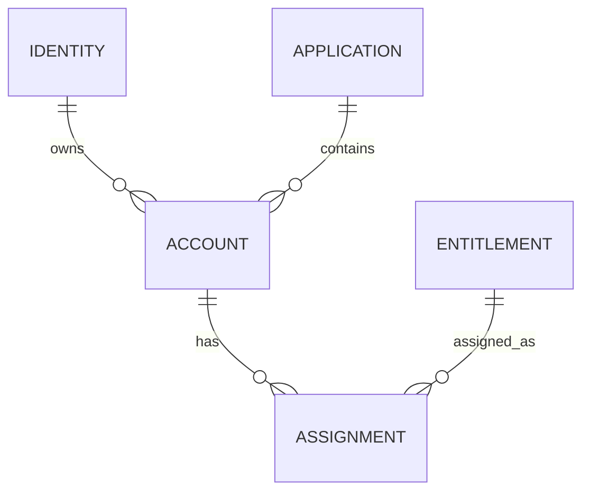

# Design Documentation Standard

## Purpose

Every Luffy service must have a consistent design package before implementation becomes serious.

The goal is to avoid building random files and ensure each app has clear objectives, architecture, schema/model, relationships, APIs, security controls, and future UI decisions.

## Required design documents per service

Each service should eventually have this structure:

```text
apps/<service-name>/
├── README.md
├── docs/
│   ├── objectives.md
│   ├── hld.md
│   ├── dld.md
│   ├── data-model.md
│   ├── relationship-diagram.md
│   ├── api-contract.md
│   ├── security-controls.md
│   ├── audit-events.md
│   └── ui-decision.md
```

Database-backed apps may also have:

```text
apps/<service-name>/db/
├── schema.sql
├── seed.sql
└── views.sql
```

API-based apps may also have:

```text
apps/<service-name>/api/
├── openapi.yaml
└── examples/
```

GraphQL apps may also have:

```text
apps/<service-name>/graphql/
├── schema.graphql
└── example-queries.graphql
```

## 1. Objectives

File:

```text
docs/objectives.md
```

Should define:

```text
What this service is
Which real-world platform type it simulates
What IAM/security concepts it teaches
What it does in Milestone 1
What it does later
What it does not do
```

## 2. HLD - High-Level Design

File:

```text
docs/hld.md
```

Should define:

```text
Service responsibility
External systems it talks to
Inbound and outbound flows
Trust boundaries
Authentication pattern
Authorization pattern
Data flow
Deployment assumption
High-level diagram
```

Example diagram format:

```text
caller -> service -> database
service -> siem-detection-service
service -> api-security-gateway
```

## 3. DLD - Detailed-Level Design

File:

```text
docs/dld.md
```

Should define:

```text
Modules
Functions/classes later
Internal processing flow
Validation rules
Error handling
Audit behavior
Security decision points
Configuration values
```

## 4. Data model / schema model

File:

```text
docs/data-model.md
```

Should define:

```text
Entities
Fields
Required fields
Allowed values
Primary keys
Foreign keys
Unique constraints
Status values
Risk values
Sample records
```

For database apps, this maps to SQL tables.

For API apps, this maps to JSON objects.

For GraphQL apps, this maps to GraphQL types.

## 5. Relationship diagram

File:

```text
docs/relationship-diagram.md
```

Should define relationships between entities.

Example:

```text
Identity 1---N Account
Account 1---N Assignment
Entitlement 1---N Assignment
Application 1---N Account
Application 1---N Entitlement
```

Use Mermaid later if needed.

Example Mermaid:



## 6. API contract

File:

```text
docs/api-contract.md
```

Should define:

```text
API style: REST / GraphQL / SCIM / SQL views / event ingestion
Endpoints or queries
Request examples
Response examples
Authentication required
Authorization required
Error format
Pagination/filtering
```

## 7. Security controls

File:

```text
docs/security-controls.md
```

Should define:

```text
Authentication
Authorization
Least privilege
Input validation
Output filtering
Rate limits
Sensitive data rules
Secret handling
Security headers if API-based
GraphQL controls if GraphQL-based
SCIM controls if SCIM-based
PAM controls if PAM-based
```

## 8. Audit events

File:

```text
docs/audit-events.md
```

Should define:

```text
Which actions create audit events
Audit event fields
Risk level
Actor
Target resource
Decision
Reason
Timestamp
Request ID
```

## 9. UI decision

File:

```text
docs/ui-decision.md
```

Should define:

```text
Does this service need UI?
If yes, when?
Which screens?
Which actions are read-only?
Which actions need approval?
```

## Required design package by service

| Service | Must have HLD/DLD? | Must have data model? | Must have API contract? | UI decision? |
|---|---|---|---|---|
| `hrms-service` | Yes | Yes | REST | Minimal UI later |
| `idp-service` | Yes | Yes | GraphQL + REST login | Minimal UI later |
| `iga-service` | Yes | Yes | GraphQL | First real UI |
| `jdbc-target` | Yes | Yes | SQL views/JDBC | Optional later |
| `webservices-target` | Yes | Yes | REST | Optional later |
| `scim-target` | Yes | Yes | SCIM 2.0 | Optional later |
| `pam-target` | Yes | Yes | REST/PAM-style | Yes later |
| `api-security-gateway` | Yes | Yes | REST | Dashboard later |
| `siem-detection-service` | Yes | Yes | Event API | Dashboard later |
| `desktop-agent-app` | Yes | Yes | Client/API later | Desktop UI later |

## Build gate

Before implementation for any service moves beyond sample files, these must exist:

```text
objectives.md
hld.md
dld.md
data-model.md
relationship-diagram.md
security-controls.md
audit-events.md
ui-decision.md
```

The API contract can be added when the service exposes APIs.

## Final rule

Do not build a service only from code.

Each service should first be understandable from documentation:

```text
Objective
Architecture
Data model
Relationships
Security
Audit
API/UI decision
```
