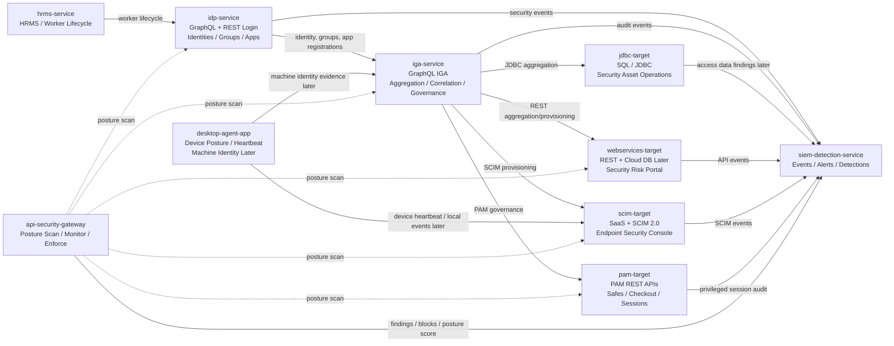
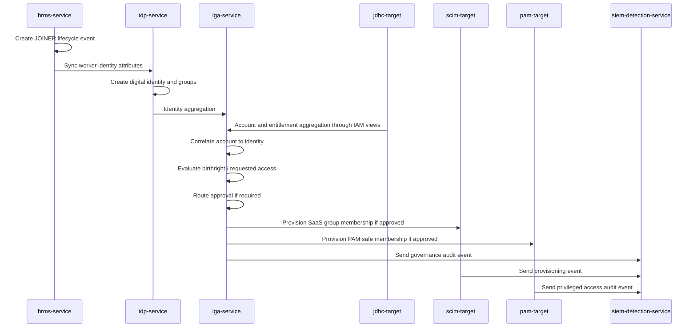
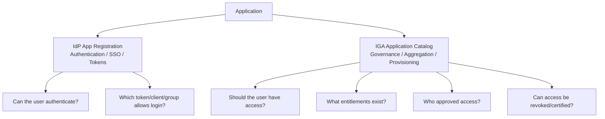
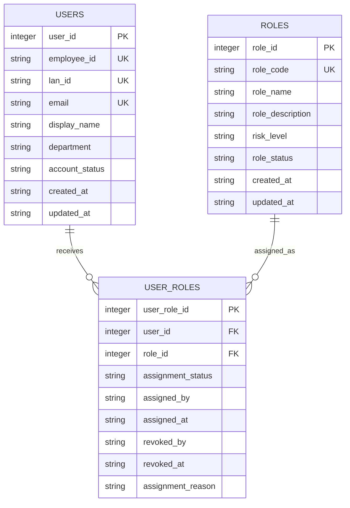
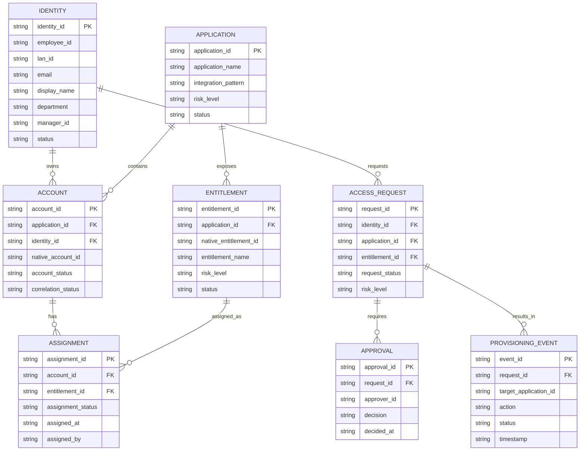
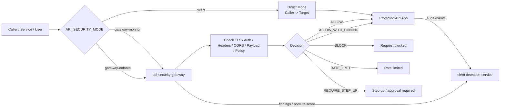
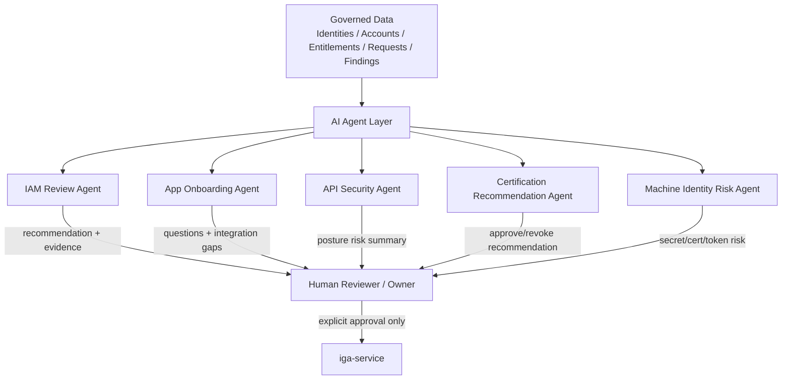

# Luffy Diagrams

This document contains Mermaid diagrams for the Luffy cybersecurity IAM lab.

## 1. High-Level Architecture

## 2. Identity Lifecycle and Governance Flow

## 3. App Registration Model

## 4. JDBC Target Entity Relationship Diagram

## 5. IGA Normalized Relationship Model

## 6. Security Control Plane Flow

## 7. Future AI Agent Layer

