# Luffy Mermaid Diagrams

This document contains the main Mermaid diagrams for the Luffy cybersecurity IAM lab.

## Diagram index

```text
1. System context diagram
2. Container/service architecture
3. Identity lifecycle sequence
4. Access request and provisioning sequence
5. App registration model
6. IGA normalized ERD
7. JDBC target ERD
8. HRMS worker lifecycle model
9. IdP identity and app registration model
10. PAM target model
11. API security gateway flow
12. SIEM detection flow
13. Machine identity model
14. UI/module map
15. Future AI agent layer
```

---

## 1. System Context Diagram

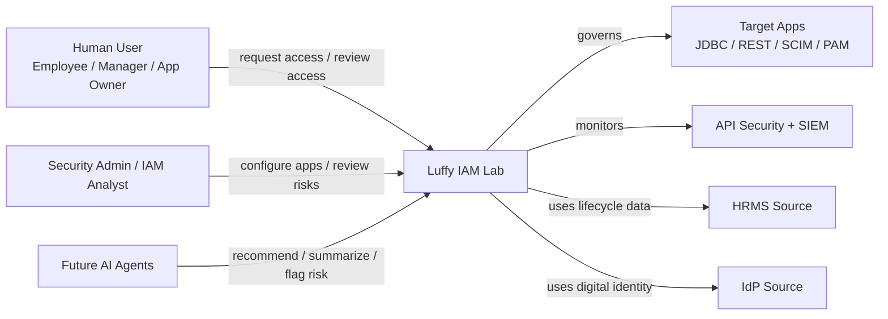

---

## 2. Container / Service Architecture

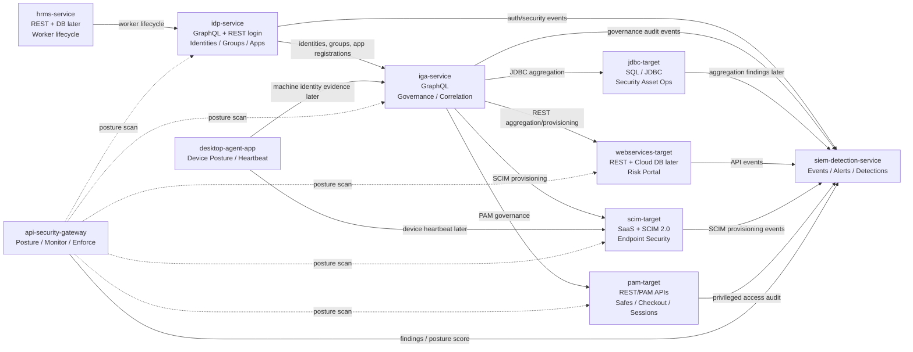

---

## 3. Identity Lifecycle Sequence

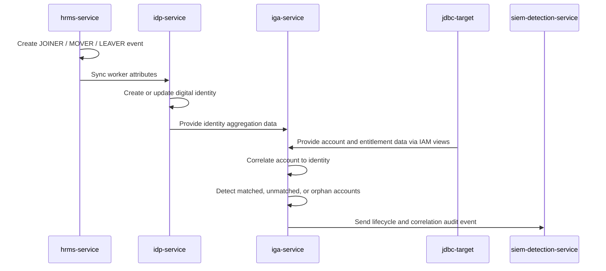

---

## 4. Access Request and Provisioning Sequence

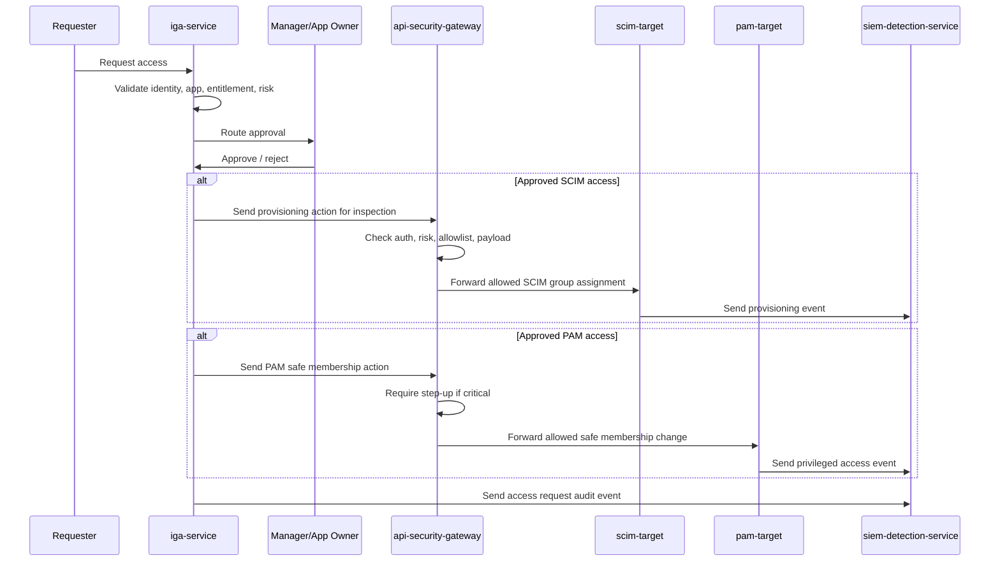

---

## 5. App Registration Model

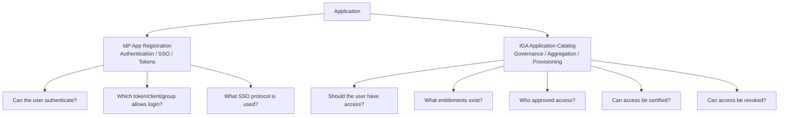

---

## 6. IGA Normalized ERD

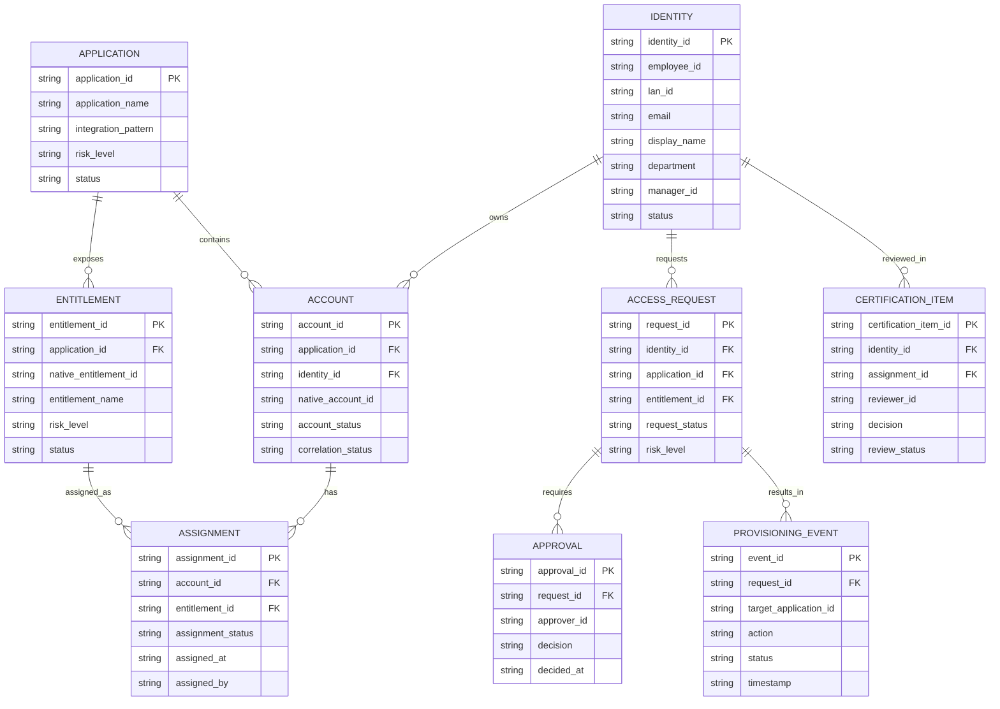

---

## 7. JDBC Target ERD

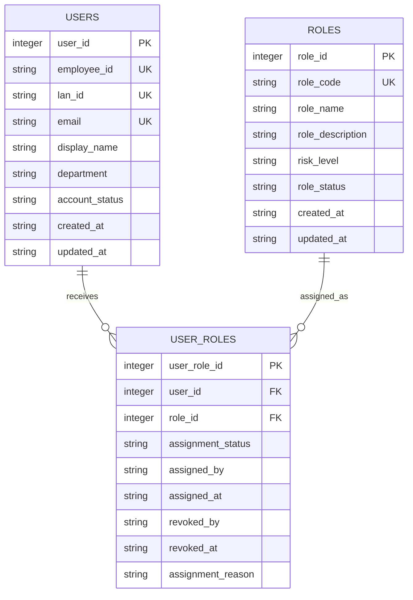

---

## 8. HRMS Worker Lifecycle Model

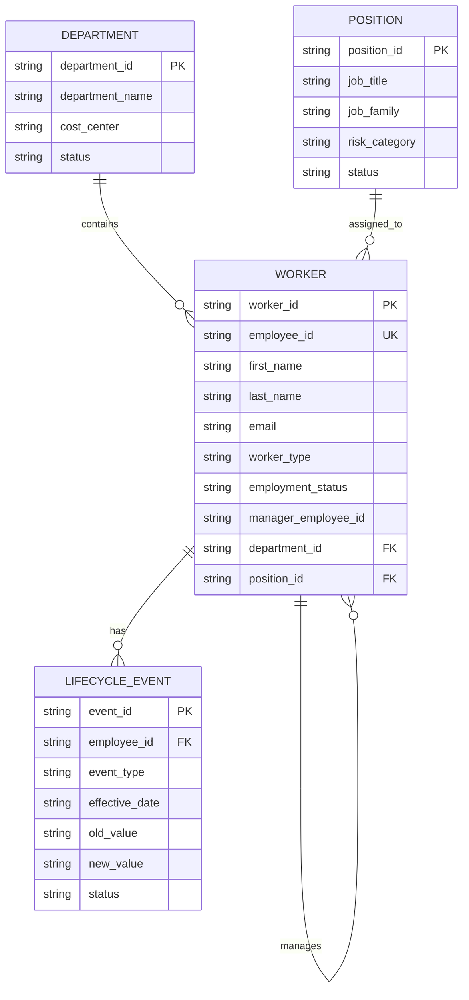

---

## 9. IdP Identity and App Registration Model

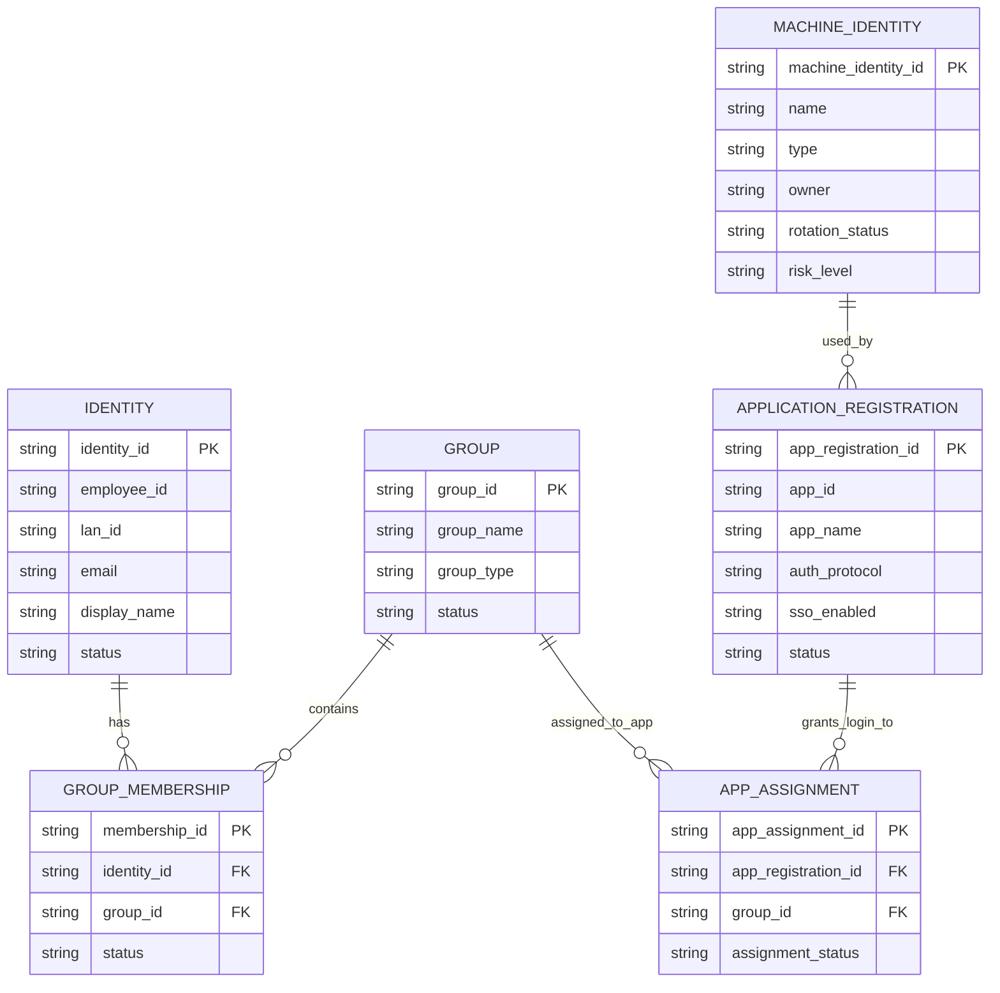

---

## 10. PAM Target Model

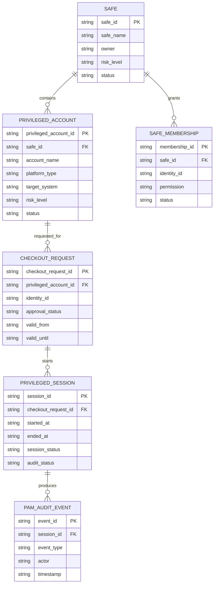

---

## 11. API Security Gateway Flow


---

## 12. SIEM Detection Flow

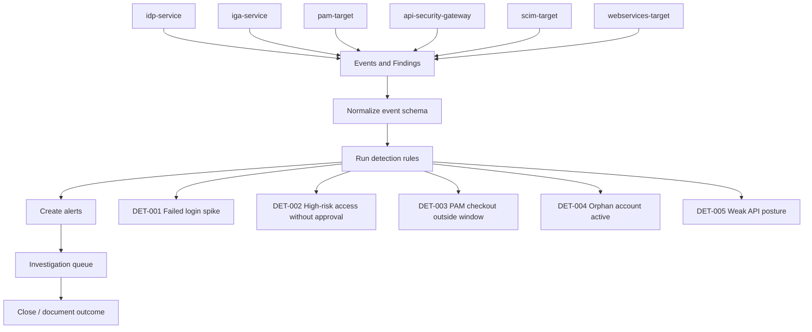

---

## 13. Machine Identity Model

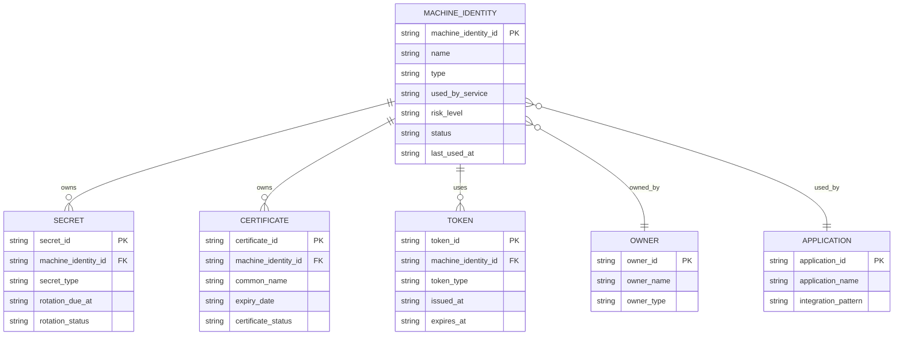

---

## 14. UI / Module Map

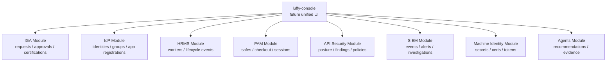

---

## 15. Future AI Agent Layer

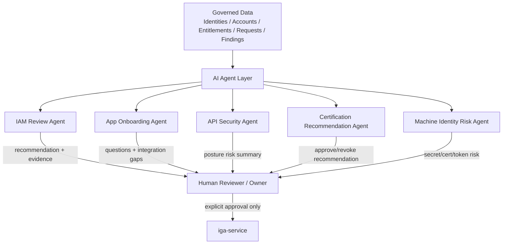
