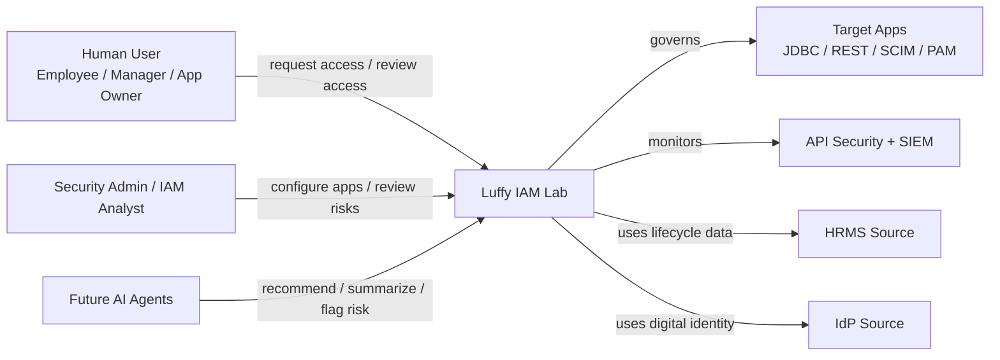
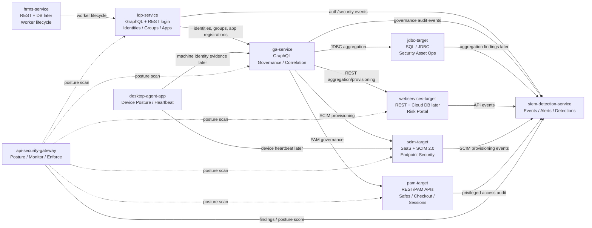
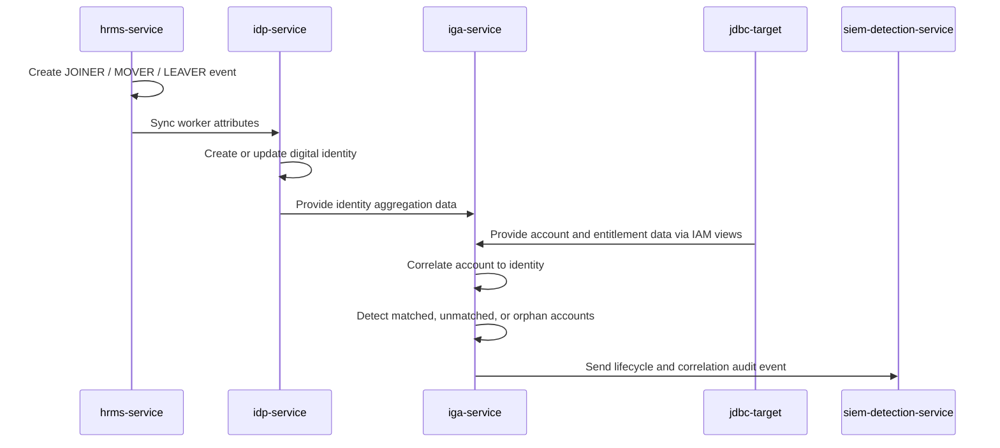
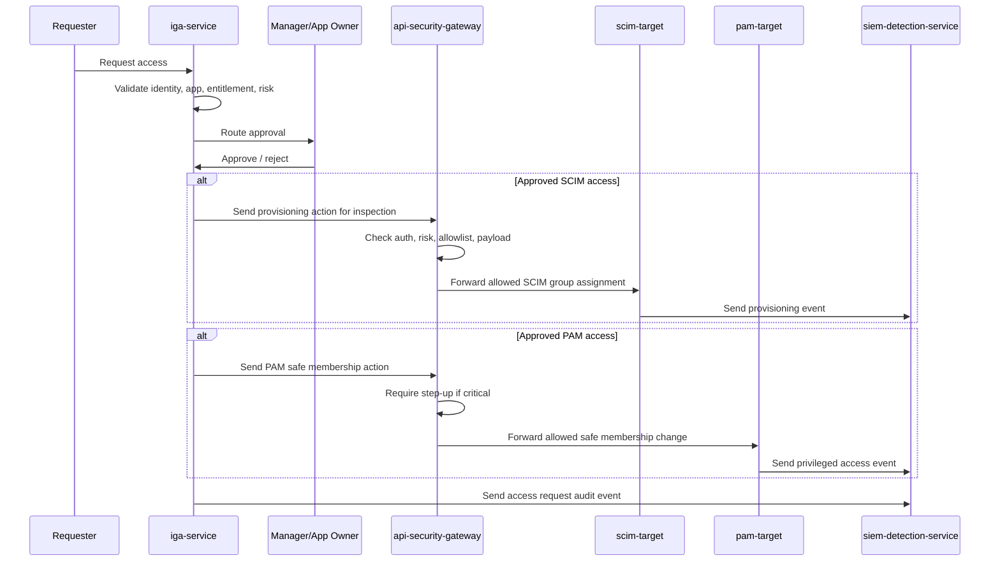
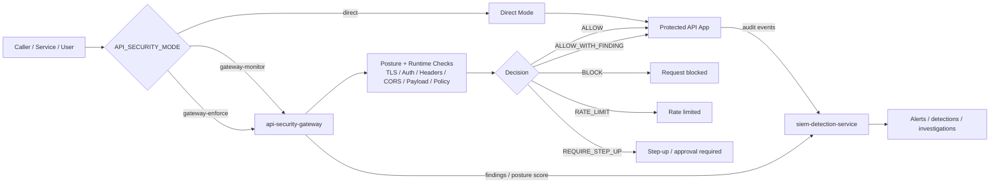
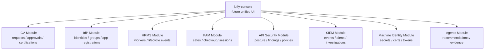
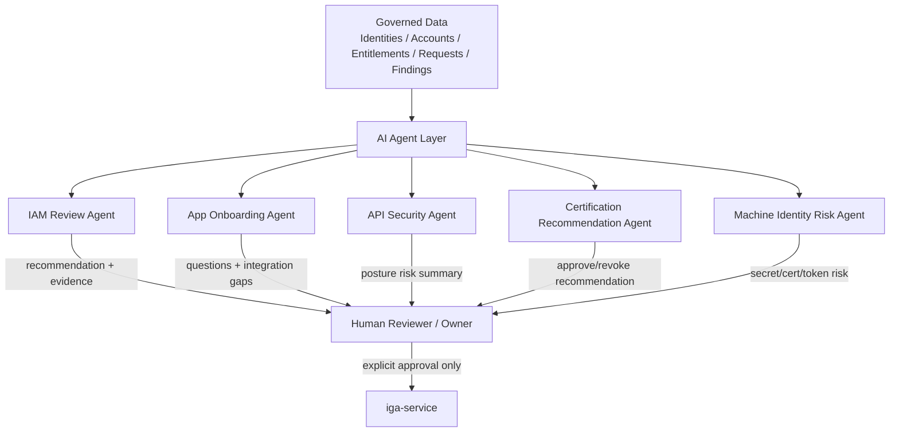

# Luffy Global Mermaid Diagrams

This document contains global system-level Mermaid diagrams for the Luffy cybersecurity IAM lab.

Detailed service-specific diagrams should live inside each service folder, for example:

```text
apps/jdbc-target/docs/diagrams.md
```

See also:

```text
docs/diagram-strategy.md
```

## Diagram index

```text
1. System context diagram
2. Container/service architecture
3. Identity lifecycle sequence
4. Access request and provisioning sequence
5. API security and SIEM overview
6. UI/module map
7. Future AI agent layer
```

---

## 1. System Context Diagram



---

## 2. Container / Service Architecture



---

## 3. Identity Lifecycle Sequence



---

## 4. Access Request and Provisioning Sequence



---

## 5. API Security and SIEM Overview



---

## 6. UI / Module Map



---

## 7. Future AI Agent Layer


